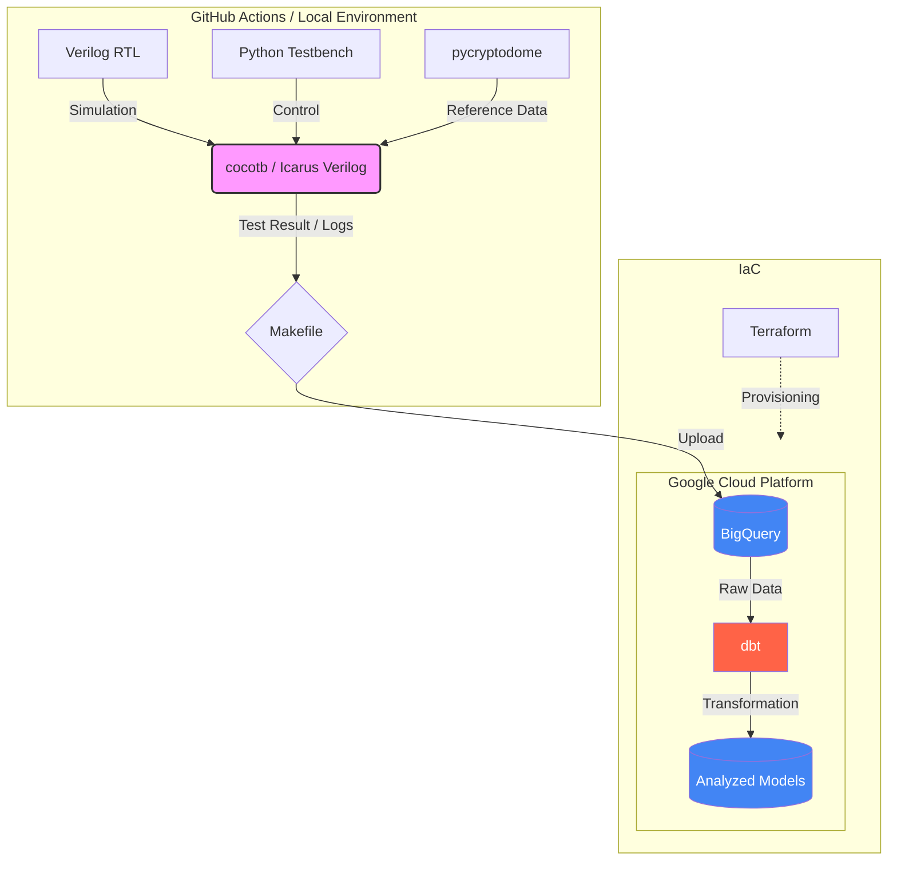

# 1.はじめに

本プロジェクトでは、暗号化アルゴリズム「AES-128」を題材に、Verilog HDL によるハードウェア設計と、Python によるソフトウェア検証を組み合わせた「協調検証環境」を構築しました。
デジタル回路設計に対して、cocotb を用いた Python ベースでの検証や、BigQuery へのデータ蓄積、dbt による解析などを試みています。
さらに、GitHub Actions を用いた CI（継続的インテグレーション）により、設計変更時の検証から解析までのパイプラインを自動化しました。
これにより、開発環境での迅速なフィードバックと、データに基づいた品質管理というモダンな開発スタイルの導入を試みています。


| ◆構成 |
|:---------------|
|[1.はじめに](#1はじめに) |
|[2.技術スタックとシステム構成](#2技術スタックとシステム構成)|
|[3.「GitHub ActionsによるCIの自動化」の環境構築](#3github-actionsによるciの自動化の環境構築)|
|[4.「GitHub Actions」の実行方法](#4github-actionsの実行方法)|
|[5.実行結果](#5実行結果)|
|[6.まとめ](#6まとめ)|


# 2.技術スタックとシステム構成

## 2-1.技術スタック

本システムでは、以下の技術スタックを採用しています。

|カテゴリ|技術・ツール|用途|
|:--- |:--- |:--- |
|Hardware|Verilog HDL/Icarus Verilog|回路記述・シミュレーション|
|Software|Python 3.11|期待値生成・比較検証スクリプト
|Data Analysis|BigQuery/dbt|検証ログの蓄積・分析モデルの構築
|Automation|GitHub Actions|プッシュ時の自動テスト実行|
|Infrastructure|Docker/Docker Compose|ツールチェーンのコンテナ化|
|IaC|Terraform|検証用環境のプロビジョニング（拡張用）|
|Management|Makefile|ビルド・テストコマンドの共通化|

### 2-1-1. ライブラリ (Python)

| ライブラリ | 説明 |
| :--- | :--- |
| cocotb | Python で記述できる、ハードウェア記述言語（VHDL/Verilog）向けのコ・シミュレーション検証フレームワーク |
| pycryptodome | 暗号化、復号、ハッシュ計算など、低レベルな暗号機能を幅広く提供する Python 自律型暗号ライブラリ |
| google-cloud-bigquery | BigQuery へのデータの読み書き、クエリ実行を行うための Google Cloud 公式クライアントライブラリ |
| dbt-bigquery | データ変換ワークフローツール「dbt」を BigQuery で動作させるための専用アダプターライブラリ |


## 2-2. ディレクトリ構成
インフラ管理（Terraform）コマンドで、デプロイできる以下の構成となっています。
このデータセットは、GitHubレポジトリ登録しています。

https://github.com/wata123-t/AES-128_GitHub_Actions

```text
.
├── .github/workflows/   # CI/CD設定（GitHub Actions）
├── aes_dbt/             # BigQuery上のデータ変換・管理（dbtプロジェクト）
├── python/              # cocotbテストベンチ・期待値生成スクリプト
├── terraform/           # Google Cloud インフラ定義（IaC）
├── verilog/             # AES-128 暗号化回路（RTL設計データ）
├── Dockerfile           # 検証ツール（Icarus Verilog/Python）の環境定義
├── docker-compose.yaml  # 複数コンテナ・環境変数の管理
├── Makefile             # 各種実行コマンドの共通化
└── README.md            # プロジェクトの概要・セットアップ手順


```

## 2-3. システム構成
システム構成と簡易フローを図示します。（詳細は後述のセクションを参照）




# 3.「GitHub ActionsによるCIの自動化」の環境構築
GitHub Actions での CI 運用を開始する前に、まずはローカル環境で各コンポーネントが正しく動作することを確認しています。これにより、CI 上での無駄なエラー試行（コストと時間のロス）を最小限に抑えています。

## 3-1. ローカル環境での実行テスト
`GitHub Actions`によるCIにて実施している自動テストは、ローカル環境での以下の動作検証をした上で、`GitHub Actions`へ移行しています。

**zzzzzzzzz ここでは、別記事へのリンクを張る zzzzz**

### 1. Terraform によるインフラ定義の検証
ローカルから `GCP` に対して `terraform apply` を実行。`BigQuery` のデータセットやテーブル構造が、後に続くシミュレーション結果の格納先として正しく構築されるかを検証しました。


### 2. `cocotb` を用いたハードソフト協調検証
`Icarus Verilog`（シミュレータ）と `Python`（検証シナリオ）、さらに暗号化処理などの `C++` モデルを組み合わせ、ハードウェアとソフトウェアを連携させたシミュレーションを実施します。

**・検証フロー:** 回路の実行結果と期待値を`Python`で比較・生成し、そのログデータを `BigQuery`へロードする一連の流れを実証しました。

### 3. `dbt`によるデータ変換と品質解析
`BigQuery`に蓄積された生のシミュレーションデータに対し、`dbt` を用いて加工・集計を行います。

**・チェック内容:** 単なる「成功/失敗」だけでなく、大量のテストパターンの中に仕様外の挙動が混入していないか、データ分析の観点から自動テスト（`dbt test`）が通ることを確認しました。


## 3-2. GitHub ActionsによるCIの自動化

`.github/workflows/`に定義されたパイプラインにより、コードをプッシュするたびに以下のプロセスが自動実行されます。

**・検証環境の自動構築:** インフラ（`Terraform`）と実行環境（`Python/iverilog`）を毎回クリーンにセットアップ
**・RTLのコンパイルとシミュレーション:** Verilogコードのコンパイルと cocotb によるテストベンチの実行
**・データ駆動型の整合性チェック:** BigQueryへ転送された実行結果を dbt で解析し、仕様との不整合を検知

これにより、回路修正時のデグレード（先祖返り）を即座に検知し、ハードウェア品質を常に高く保てる環境を整えました。


<details>
<summary>コード(.github/workflows/verify.yml)</summary>

```yaml
name: AES-128 検証パイプライン

# mainブランチにコードが push（送信）された時に自動実行
on:
  push:
    branches: [ main ]
  workflow_dispatch: # 手動実行ボタン

# 自動実行する内容一覧
jobs:
  aes_test:
    # GitHubが提供する最新の Ubuntu（Linux）サーバーを使用
    name: AES回路の検証実行
    runs-on: ubuntu-latest
    
    steps:
      - name: ソースコードのチェックアウト
        uses: actions/checkout@v4

      - id: 'auth'
        name: 1. Google Cloud 認証の実行
        uses: 'google-github-actions/auth@v2'
        with:
          credentials_json: '${{ secrets.GCP_SA_KEY }}'

      - name: 2. Verilog シミュレータ (iverilog) のインストール
        run: |
          sudo apt-get update
          sudo apt-get install -y iverilog

      - name: 3. Python(3.10)のセットアップ
        uses: actions/setup-python@v5
        with:
          python-version: '3.10'
          cache: 'pip'

      - name: 4. Python ライブラリのインストール
        run: |
          pip install cocotb google-cloud-bigquery pycryptodome dbt-bigquery

      - name: 5. Terraform のセットアップ
        uses: hashicorp/setup-terraform@v3

      - name: 6. BigQuery リソースの作成 (Terraform Apply)
        env:
          GOOGLE_APPLICATION_CREDENTIALS: ${{ steps.auth.outputs.credentials_file_path }}
        run: |
          cd ./terraform
          terraform init
          terraform apply -auto-approve \
            -var="project_id=${{ secrets.GCP_PROJECT_ID }}" \
            -var="region=asia-northeast1" \
            -var="dataset_id=aes_verification_dataset"

      - name: 7. 回路シミュレーション実行と結果の転送
        env:
          GOOGLE_APPLICATION_CREDENTIALS: ${{ steps.auth.outputs.credentials_file_path }}
          PYTHONPATH: ${{ github.workspace }}/python
        run: |
          make

      - name: 8. dbt によるデータ変換と品質テスト
        env:
          GOOGLE_APPLICATION_CREDENTIALS: ${{ steps.auth.outputs.credentials_file_path }}
          GCP_PROJECT_ID: ${{ vars.GCP_PROJECT_ID }}
          DBT_PROFILES_DIR: .
        run: |
          cd aes_dbt
          dbt debug
          dbt run --full-refresh
          dbt test

      - name: 9. 検証用リソースの削除 (Terraform Destroy)
        if: always()
        run: |
          cd ./terraform
          terraform destroy -auto-approve \
            -var="project_id=${{ secrets.GCP_PROJECT_ID }}"
```

</details>


:::note info
🚀 効率化ポイント
>#### ①`workflow_dispatch` でデバッグを快適に
GitHub 画面に **「手動実行ボタン」** を表示させる設定です。
**●メリット:** `git push` しなくても、ボタン一つで再実行が可能。今回のような Terraform や dbt を含む重い処理で、「環境設定だけ変えて試したい」という時のデバッグ効率が圧倒的に向上します。
>#### ②「ステップ名（表示名）」の日本語化
 **`-name`:** に日本語を使用すると、実行画面の実用性がグンと上がります。

**・エラーの早期発見:** どの工程で失敗したのか、英語のログを読み解く前に直感的にわかります。
**・進捗の可視化:** 「どこまで処理が進んだか」がひと目で判断でき、運用・メンテナンスのストレスを軽減します。
:::

# 4.「GitHub Actions」の実行方法
今回のプロジェクトは、以下に格納しています。
https://github.com/wata123-t/AES-128_GitHub_Actions

## 4-1.環境変数設定
GitHub に、Actions 用の2個の環境変数を設定します。

**1. メニュー選択**
`Settings`→`Secrets and variables`→`Actions`


**2. 設定する環境変数**

| 環境変数 | 説明 |
| :--- | :--- |
|GCP_PROJECT_ID| BigQueryを動かすGCPのプロジェクトIDです|
|GCP_SA_KEY|BigQuery操作権限を持つサービスアカウントのJSONキーです。発行されたJSONファイル内容をすべてコピーして貼り付けてください。|

## 4-2.実行コマンド
自分のGitHubリポジトリで`GitHub Actions`(自動化)を試すための手順となります。

```bash
# 1. ソースコードをローカルにダウンロード
git clone https://github.com/wata123-t/AES-128_GitHub_Actions

# 2. プロジェクトのディレクトリへ移動
cd AES-128_GitHub_Actions

# 3. Gitリポジトリとして初期化
git init

# 4. 全てのファイルをコミット対象に追加
git add .

# 5. 現在の状態をローカルに記録
git commit -m "Initial commit"

# 6. 自分のGitHubリポジトリを送信先に設定
git remote add origin (あなたのリポジトリURL)

# 7. メインブランチ名を「main」に設定
git branch -M main

# 8. 自分のリポジトリへデータを反映
git push -u origin main
```
:::note info
**注意**
「手順6」のURLは、あらかじめ自分の`GitHub`アカウントで作成した空のリポジトリのURLに書き換えてください。
:::


# 5.実行結果
実行結果の見方や再実行方法などに関して説明します。

---
## 5-1. 結果一覧
実行結果が全て`PASS`すると、下図のように全ての工程にチェックマークがつきます。


### -- ***実行フェーズの解説*** --

**1.メイン工程:** 
「9. 検証用リソースの削除」までは、`.github/workflows/verify.yml`に記述した手順が上から順番に実行されます。

**2.事後処理(Post):** 
メイン工程が終了後、以下の3個の「後片付け」処理を自動で実施します。
1. **「Post3. Pythonのセットアップ」:** インストールした環境の解除
2. **「Post1. Google Cloud 認証」:** 認証情報のクリーンアップ
3. **「Post ソースコードのチェックアウト」:** 一時的に展開したデータの削除

**3.Complete job:**
すべての片付けが終わり、今回のCI工程が完全に終了したことを示します。


---
## 5-2. 実行ログの確認
各ステップをクリックすると、詳細な実行ログが表示されます。
エラーが発生した際の原因特定はもちろん、正常終了時も「どのような処理が行われたか」を後から詳しく振り返ることができます。


---
## 5-3. 過去履歴

`git push`するたびにワークフローが自動実行され、その結果が履歴として残ります。
**赤色アイコン（エラー）:** 自動テストや処理の途中で問題が発生したことを示します。
**緑色アイコン（成功）:** すべての工程が正常に完了（PASS）したことを示します。
**各項目のタイトル:** `git commit`のメッセージが表示されるためので変更内容が分かります。

:::note info
不要になった履歴は、個別に、または一括で削除することも可能です。
:::


---
## 5-4. 再実行方法
`git push`を行わなくても、GitHub上の操作だけでワークフローを再度動かせます。

1. 右上の 「Re-run all jobs」 ボタンをクリックします。
2. 確認画面が表示されるので、緑色の 「Re-run jobs」 をクリックして実行します。

ソースコードを修正せずに「テスト環境の調子を確かめたい」、「一時的なエラーを解消して再試行したい」などのデバッグ時に便利な機能です


# 6.まとめ
本プロジェクトでは、実務での活用シーンが多い以下の技術を組み合せました。
**検証の確実性:** PDocker化により、誰でも同じ環境でシミュレーションが可能。
**環境構築の容易化:** BigQuery を活用した効率的なデータ集計・分析
**CI/CDの導入:** ハードウェア設計においても、ソフトウェア開発のようなアジャイルな検証サイクルを実現。
今後は、さらに複雑な回路への適用や、カバレッジ測定の自動化など、検証環境の高度化を進めていきたいと考えています。
